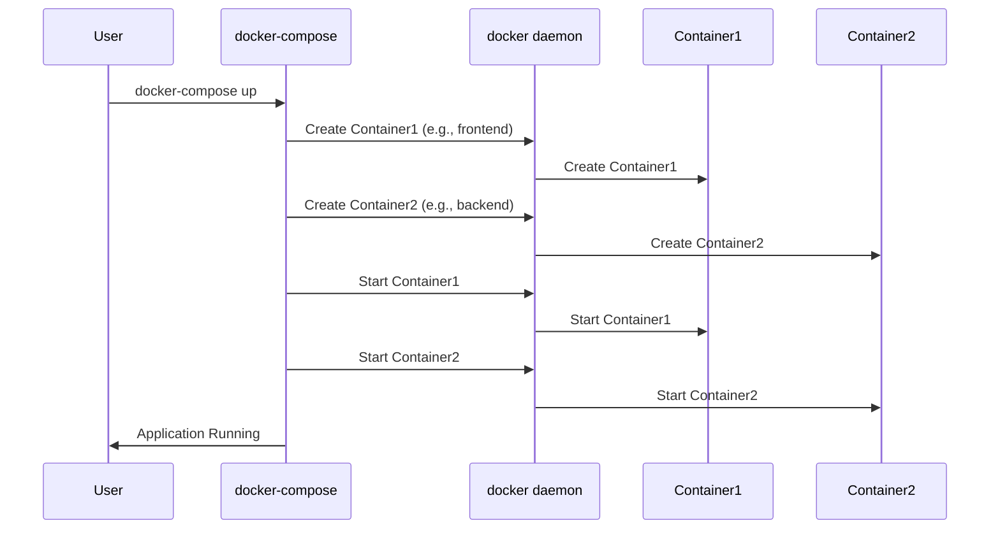

# Chapter 1: Docker Compose

Welcome to the world of container monitoring! Before we dive deep into monitoring tools, we need a way to easily manage multiple Docker containers. That's where Docker Compose comes in.

Imagine you're building a website. You might need a container for the frontend (what users see), another for the backend (the server logic), and a third for the database (where the data is stored). Manually starting and connecting these containers every time you want to work on your website would be tedious and error-prone.

Docker Compose solves this problem! It's like a recipe book for your application. You define all your containers and their relationships in a single file, and then Docker Compose takes care of starting and connecting them all with a single command.

## What is Docker Compose?

Docker Compose is a tool for defining and running multi-container Docker applications. Think of it as a way to orchestrate your Docker containers.

Here are the key concepts:

*   **`docker-compose.yaml` file:** This is the "recipe book." It's a YAML file that describes all the services (containers) that make up your application, how they are configured, and how they interact.
*   **Services:** Each service represents a single container that you want to run. For example, you might have a service for your web application, another for your database, and another for a caching server.
*   **Orchestration:** Docker Compose handles the complex task of starting the containers in the correct order, connecting them to each other, and managing their dependencies.

## Why Use Docker Compose?

*   **Simplified Management:** Start, stop, and manage your entire application with a single command.
*   **Reproducibility:** Define your application's dependencies in a file, ensuring that everyone on your team can run the same environment.
*   **Scalability:** Easily scale your application by adding more containers.
*   **Testability:** Create isolated environments for testing your application.

## A Simple Example

Let's look at a simplified example of a `docker-compose.yaml` file:

```yaml
version: '3'
services:
  web:
    image: nginx:latest
    ports:
      - "80:80"
```

This file defines a single service called `web`.

*   `version: '3'` specifies the version of the Docker Compose file format.
*   `services:` defines the services that make up your application.
*   `web:` defines a service named "web."
*   `image: nginx:latest` tells Docker Compose to use the `nginx:latest` image from Docker Hub. Nginx is a popular web server.
*   `ports: - "80:80"` maps port 80 on your host machine to port 80 on the container.  This means you can access the web server by going to `http://localhost` in your browser.

To run this, save it as `docker-compose.yaml` in an empty directory. Then, open a terminal in that directory and run:

```bash
docker-compose up
```

This command will:

1.  Download the `nginx:latest` image (if you don't already have it).
2.  Create a container from the image.
3.  Start the container.
4.  Map port 80 on your host machine to port 80 on the container.

You should now be able to open your web browser and go to `http://localhost`. You should see the default Nginx welcome page.

To stop the containers, you can run:

```bash
docker-compose down
```

This command will stop and remove the containers created by Docker Compose.

## Our `docker-compose.yaml` file (for container monitoring)

Let's take a look at the `docker-compose.yaml` file we'll be using for our container monitoring project:

```yaml
version: '3'
services:
  frontend:
    image: registry.gitlab.com/saminbjit/mernapp-frontend:v0.0.31
    container_name: frontend
    ports:
      - "80:80"
    networks:
      - prom_net

  backend:
    image: registry.gitlab.com/saminbjit/mernapp:v1.0.0
    container_name: backend-service
    ports:
      - "5000:5000"
    environment:
      - MONGODB_USERNAME=root
      - MONGODB_PASSWORD=mongopassword
      - MONGODB_DBNAME=examdb
      - MONGODB_SERVICE_NAME=mongodb-service
      - MONGODB_HEADER=mongodb
    networks:
      - prom_net


  mongodb:
    image: mongo:4.4.6
    container_name: mongodb-service
    environment:
      - MONGO_INITDB_ROOT_USERNAME=root
      - MONGO_INITDB_ROOT_PASSWORD=mongopassword
      - MONGO_INITDB_DATABASE=examdb
    command: ["--bind_ip_all"]
    ports:
      - "27017:27017"
    networks:
      - prom_net

  prometheus:
    image: prom/prometheus
    container_name: prometheus
    extra_hosts:
      - "host.docker.internal:host-gateway"
    ports:
      - "9090:9090"
    volumes:
      - "./prom_config:/etc/prometheus/"
    networks:
      - prom_net

  grafana:
    image: grafana/grafana
    hostname: grafana
    container_name: grafana
    environment:
      - GF_SECURITY_ADMIN_PASSWORD=admin
      - GF_USERS_ALLOW_SIGN_UP=false
    depends_on:
      - prometheus
    networks:
      - prom_net
    ports:
      - 3000:3000
    volumes:
      - ./grafana/provisioning/:/etc/grafana/provisioning/ 
      
  alertmanager:
    image: prom/alertmanager:v0.23.0
    container_name: alertmanager
    restart: unless-stopped
    ports:
      - "9093:9093"
    networks:
      - prom_net
    volumes:
      - "./am_config:/config"
      - "alertmanager_data:/data"
    command: --config.file=/config/alertmanager.yml --log.level=debug

# Exporters
  node-exporter:
    image: prom/node-exporter
    container_name: node-exporter
    volumes:
      - /proc:/host/proc:ro
      - /sys:/host/sys:ro
      - /:/rootfs:ro
    command: 
      - '--path.procfs=/host/proc' 
      - '--path.sysfs=/host/sys'
      - --collector.filesystem.ignored-mount-points
      - "^/(sys|proc|dev|host|etc|rootfs/var/lib/docker/containers|rootfs/var/lib/docker/overlay2|rootfs/run/docker/netns|rootfs/var/lib/docker/aufs)($$|/)"
    ports:
      - 9100:9100
    networks:
      - prom_net
    restart: unless-stopped

  blackbox_exporter:
    image: quay.io/prometheus/blackbox-exporter:latest
    container_name: blackbox_exporter
    ports:
      - "9115:9115"
    configs:
      - source: blackbox_config
        target: /config
    volumes:
      - "./bbox_config:/config"
    networks:
      - prom_net

  cadvisor:
    image: gcr.io/cadvisor/cadvisor:v0.47.0
    container_name: cadvisor
    command:
      - '-port=8080'
    ports:
      - "8080:8080"
    networks:
      - prom_net
    volumes:
      - /:/rootfs:ro
      - /var/run:/var/run:ro
      - /sys:/sys:ro
      - /var/lib/docker/volumes:/var/lib/docker/volumes:ro
      - /dev/disk/:/dev/disk:ro
    devices:
      - /dev/kmsg
    privileged: true
    restart: unless-stopped

configs:
  blackbox_config:
    file: ./bbox_config/blackbox.yaml
     
networks:
  prom_net:

volumes:
  grafana_volume:
  alertmanager_data:
```

Whoa! That's a lot, but don't worry, we'll break it down.

*   **Multiple Services:**  This `docker-compose.yaml` file defines a more complex application consisting of many services, including a frontend, backend, database (MongoDB), Prometheus (the monitoring system), Grafana (the dashboard), and other monitoring tools (exporters).
*   **Dependencies:** Services can depend on each other.  For example, `grafana` has `depends_on: - prometheus`. This tells Docker Compose to start Prometheus before Grafana.
*   **Networks:** The `networks` section defines a network called `prom_net`. All the services are connected to this network, allowing them to communicate with each other. Think of it as creating a local network where all your containers can see each other.
*   **Volumes:** The `volumes` section defines volumes that persist data even when the containers are stopped. This is important for things like the Prometheus data and Grafana configurations. The lines like `./prom_config:/etc/prometheus/` maps a directory `./prom_config` to `/etc/prometheus/` inside of container `prometheus`.
*   **Environment variables:** The `environment` section defines the environment variables to be passed to services such as `backend` or `mongodb`.

To bring up all these services, run `docker-compose up` in the same directory as your `docker-compose.yaml` file. You can add `-d` to detach and run in the background: `docker-compose up -d`.

## Internal Implementation (Simplified)

Let's see what happens behind the scenes when you run `docker-compose up`. This is a simplified view, but it will give you a basic idea.



1.  The user runs the `docker-compose up` command.
2.  Docker Compose reads the `docker-compose.yaml` file.
3.  For each service defined in the file, Docker Compose instructs the Docker daemon to create and start the corresponding container. Docker Compose manages dependencies between containers and starts them in the correct order.
4.  The Docker daemon pulls the necessary images and creates the containers.
5.  The containers start and connect to each other according to the network configurations defined in the `docker-compose.yaml` file.
6.  Finally, the user is informed that the application is running.

While the `docker-compose` tool itself is written in Python, it primarily acts as a client to the Docker daemon. It leverages the Docker Engine API to perform all the heavy lifting, such as creating, starting, and managing containers, networks, and volumes. The `docker-compose.yaml` file is parsed, and instructions are sent to the Docker daemon to achieve the desired state of the application.

## Conclusion

Docker Compose is a powerful tool for managing multi-container Docker applications. It simplifies the process of starting, stopping, and connecting containers, making it easier to develop, test, and deploy complex applications. In the following chapters, we'll use Docker Compose to set up our container monitoring environment.

Now that you understand Docker Compose, we can move on to setting up Prometheus, which will be our main monitoring tool. Head over to [Prometheus](02_prometheus_.md) to learn more!


