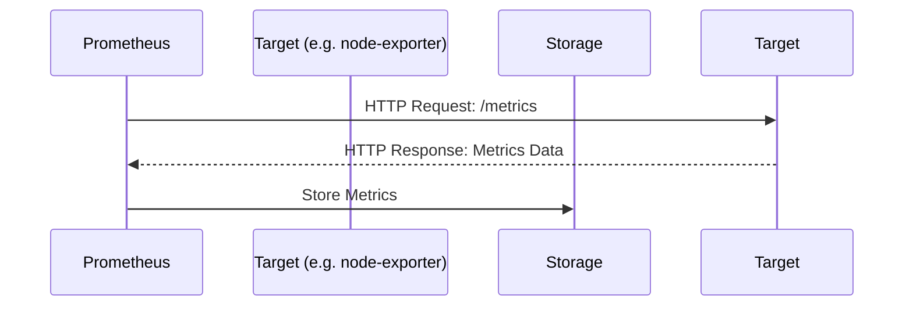

# Chapter 2: Prometheus

In the previous chapter, [Docker Compose](01_docker_compose_.md), we learned how to manage multiple Docker containers as a single application. Now, let's imagine our application is running smoothly, but how do we know if it's *actually* healthy? Is the backend responding quickly? Is the database running out of space? That's where Prometheus comes in!

Think of Prometheus as a doctor for your applications. It constantly monitors their "vital signs" and alerts you if something goes wrong.

## What is Prometheus?

Prometheus is a monitoring and alerting toolkit. Here's a breakdown of the key concepts:

*   **Metrics:** These are numerical data points that represent the health and performance of your application. Examples include CPU usage, memory consumption, request latency, and error rates. Prometheus *collects* these metrics.
*   **Scraping:** Prometheus uses a "pull" model.  This means it *actively asks* your applications for their metrics at regular intervals.  It "scrapes" the metrics from targets.
*   **Targets:** These are the applications or services that Prometheus monitors.  In our case, these will be our Docker containers (like our frontend, backend, and node exporter).
*   **PromQL:** This is the query language that Prometheus uses to analyze the collected metrics. We'll dive into this later.
*   **Alerts:** Prometheus can be configured to trigger alerts based on predefined rules. For example, you can set up an alert if the CPU usage of your backend container exceeds 80%.

## Why use Prometheus?

Imagine your website suddenly slows down in the middle of the night. Without monitoring, you might not even realize there's a problem until users start complaining. Prometheus can help you:

*   **Identify problems early:** Detect issues before they impact users.
*   **Troubleshoot performance bottlenecks:** Pinpoint the root cause of slow response times.
*   **Optimize resource usage:** Identify underutilized resources and scale accordingly.
*   **Gain insights into application behavior:** Understand how your application is performing over time.

## A Simple Analogy

Think of a car dashboard. It displays important information like speed, fuel level, and engine temperature. Prometheus is like a dashboard for your applications, showing you key metrics that indicate their health and performance.

## Getting Started with Prometheus

In our `docker-compose.yaml` file (from the previous chapter), we already have a Prometheus service defined:

```yaml
  prometheus:
    image: prom/prometheus
    container_name: prometheus
    extra_hosts:
      - "host.docker.internal:host-gateway"
    ports:
      - "9090:9090"
    volumes:
      - "./prom_config:/etc/prometheus/"
    networks:
      - prom_net
```

Let's break down what this means:

*   `image: prom/prometheus`:  This specifies the Docker image to use for Prometheus.  `prom/prometheus` is the official Prometheus image from Docker Hub.
*   `container_name: prometheus`: This gives the container a name, making it easier to identify.
*   `ports: - "9090:9090"`: This maps port 9090 on your host machine to port 9090 on the container.  You'll use this port to access the Prometheus web interface.
*   `volumes: - "./prom_config:/etc/prometheus/"`: This is important!  It mounts a directory `./prom_config` on your host machine to the `/etc/prometheus/` directory inside the container. This is where Prometheus expects to find its configuration file (`prometheus.yml`).  This lets us configure Prometheus!
*   `networks: - prom_net`:  This attaches the Prometheus container to the `prom_net` network, allowing it to communicate with other containers.

## Configuring Prometheus

The heart of Prometheus is its configuration file, `prometheus.yml`. This file tells Prometheus:

*   Where to find the targets to scrape (e.g., your frontend, backend, node exporter).
*   How often to scrape the targets.
*   What rules to use for alerting.

Here's a simplified snippet from our `prom_config/prometheus.yml` file:

```yaml
global:
  scrape_interval: 15s

scrape_configs:
  - job_name: 'node-exporter'
    static_configs:
      - targets: ["node-exporter:9100"]
```

Explanation:

*   `global:` section sets global settings. `scrape_interval: 15s` tells Prometheus to scrape targets every 15 seconds.
*   `scrape_configs:` section defines the scraping jobs.  Each job specifies how to scrape a set of targets.
*   `job_name: 'node-exporter'`: This defines a job named "node-exporter."
*   `static_configs:` section lists the targets to scrape.
*   `targets: ["node-exporter:9100"]`: This tells Prometheus to scrape the `node-exporter` container at port 9100. We'll learn about Node Exporter in a later chapter.

**What will happen?**

When Prometheus starts, it will read this configuration. Every 15 seconds, it will connect to the `node-exporter` container at port 9100 and request its metrics.  Prometheus will then store these metrics and make them available for querying.

## Accessing the Prometheus Web Interface

If you followed the previous chapter and ran `docker-compose up`, you should be able to access the Prometheus web interface by opening your browser and going to `http://localhost:9090`.

You'll see a page where you can query the collected metrics using PromQL.

## A simple PromQL Query

In the Prometheus web interface, in the expression input, type:

```
up
```

And press enter. `up` is a built-in metric that indicates whether a target is up (1) or down (0).  You should see results indicating the status of your configured targets (like `node-exporter`).

**What will happen?**

Prometheus will execute the query and display the results in a table or graph.  You'll see the value of the `up` metric for each of your targets.

## Internal Implementation

Let's see what happens behind the scenes when Prometheus scrapes a target.



1.  Prometheus periodically sends an HTTP request to the `/metrics` endpoint of the target.
2.  The target (e.g., `node-exporter`) responds with a text-based format containing its metrics data.
3.  Prometheus parses the metrics data and stores it in its time-series database.

The main file for Prometheus is usually `main.go`.  Inside, you'll see logic for:

*   Reading the configuration file (`prometheus.yml`).
*   Setting up the HTTP server for the web interface.
*   Managing the scraping loops.
*   Storing the metrics data.

Here is a hypothetical simplification for reading the config. It does not represent any actual code.

```go
// This is not actual Prometheus code
package main

import (
	"fmt"
	"io/ioutil"
	"gopkg.in/yaml.v2" // You might need to install this: go get gopkg.in/yaml.v2
)

type Config struct {
	Global struct {
		ScrapeInterval string `yaml:"scrape_interval"`
	} `yaml:"global"`
	ScrapeConfigs []struct {
		JobName string `yaml:"job_name"`
		StaticConfigs []struct {
			Targets []string `yaml:"targets"`
		} `yaml:"static_configs"`
	} `yaml:"scrape_configs"`
}

func main() {
	// Read the YAML file
	yamlFile, err := ioutil.ReadFile("prom_config/prometheus.yml")
	if err != nil {
		fmt.Printf("Error reading YAML file: %s\n", err)
		return
	}

	// Unmarshal the YAML data into the Config struct
	var config Config
	err = yaml.Unmarshal(yamlFile, &config)
	if err != nil {
		fmt.Printf("Error unmarshaling YAML: %s\n", err)
		return
	}

	// Print the parsed data (for demonstration)
	fmt.Printf("Scrape Interval: %s\n", config.Global.ScrapeInterval)
	for _, job := range config.ScrapeConfigs {
		fmt.Printf("Job Name: %s\n", job.JobName)
		for _, staticConfig := range job.StaticConfigs {
			fmt.Printf("  Targets: %v\n", staticConfig.Targets)
		}
	}
}
```

**Explanation:**

This simplified program demonstrates how Prometheus reads its configuration file (`prometheus.yml`). It uses the `gopkg.in/yaml.v2` library to parse the YAML file into a `Config` struct. This allows Prometheus to dynamically determine the scrape interval and the targets to monitor. Real Prometheus code would have much more error handling and validations.

## Conclusion

Prometheus is a powerful tool for monitoring your applications and alerting you to potential problems.  We've covered the basic concepts of Prometheus, how to configure it, and how to access its web interface.  In the next chapter, [Grafana](03_grafana_.md), we'll learn how to use Grafana to visualize the metrics collected by Prometheus and create beautiful dashboards.


