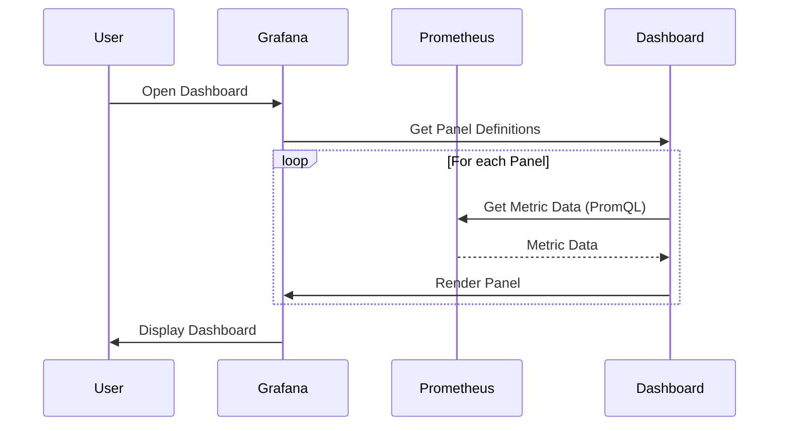

# Chapter 3: Grafana

In the previous chapter, [Prometheus](02_prometheus_.md), we learned how to collect metrics from our applications. But raw numbers can be hard to understand! Imagine looking at a huge spreadsheet of CPU usage data. Wouldn't it be easier to see a graph showing how CPU usage changes over time? That's where Grafana comes in!

Think of Grafana as the artist that transforms the raw data from Prometheus into beautiful and informative visualizations.

## What is Grafana?

Grafana is a data visualization tool. Here's the basic idea:

*   **Data Source:** Grafana connects to a data source, like Prometheus, to retrieve metrics.
*   **Dashboards:** You create dashboards in Grafana to display your metrics using various panels (charts, graphs, tables, gauges, etc.).
*   **Panels:** Each panel visualizes a specific metric or set of metrics. You can customize the panel type, colors, labels, and more.

Essentially, Grafana takes the data Prometheus collects and turns it into something you can easily understand at a glance.

## Why use Grafana?

Let's say you want to monitor the CPU usage of your backend server and the number of requests it's handling.  Grafana allows you to:

*   **Visualize trends over time:** See how CPU usage and request rates change throughout the day.
*   **Identify performance bottlenecks:** Quickly spot spikes in CPU usage or drops in request rates.
*   **Create a central monitoring dashboard:**  Combine metrics from multiple sources into a single view.

Think of it as a control panel for your entire system.

## Getting Started with Grafana

In our `docker-compose.yaml` file (from [Docker Compose](01_docker_compose_.md)), we already have a Grafana service defined:

```yaml
  grafana:
    image: grafana/grafana
    hostname: grafana
    container_name: grafana
    environment:
      - GF_SECURITY_ADMIN_PASSWORD=admin
      - GF_USERS_ALLOW_SIGN_UP=false
    depends_on:
      - prometheus
    networks:
      - prom_net
    ports:
      - 3000:3000
    volumes:
      - ./grafana/provisioning/:/etc/grafana/provisioning/
```

Let's break down what this means:

*   `image: grafana/grafana`:  This specifies the Docker image to use for Grafana. `grafana/grafana` is the official Grafana image from Docker Hub.
*   `container_name: grafana`: This gives the container a name.
*   `environment:`: These lines set environment variables to configure Grafana. `GF_SECURITY_ADMIN_PASSWORD=admin` sets the default admin password to "admin".
*   `depends_on: - prometheus`:  This ensures that Prometheus is started *before* Grafana. Grafana needs Prometheus to be running so it can connect to it as a datasource.
*   `ports: - 3000:3000`: This maps port 3000 on your host machine to port 3000 on the container. You'll use this port to access the Grafana web interface.
*   `volumes: - ./grafana/provisioning/:/etc/grafana/provisioning/`: This mounts a directory `./grafana/provisioning/` to `/etc/grafana/provisioning/` inside the container. This is used to automatically configure datasources and dashboards when Grafana starts.

## Accessing the Grafana Web Interface

If you followed the previous chapters and ran `docker-compose up`, you should be able to access the Grafana web interface by opening your browser and going to `http://localhost:3000`.

You'll be prompted to log in. Use the username "admin" and the password "admin" (as configured in the `docker-compose.yaml` file).

## Configuring a Data Source

When you first log in, Grafana will likely ask you to add a data source. However, our `docker-compose.yaml` file has been configured to automatically provision the Prometheus datasource and import dashboards using the volume mount for `./grafana/provisioning/`.

This provisioning is configured through YAML files within the `grafana/provisioning` directory. Here's what the files do:

*   `grafana/provisioning/datasources/datasource.yml`: This file defines the Prometheus data source, telling Grafana how to connect to our Prometheus instance. Specifically, this line: `url: http://prometheus:9090` tells Grafana to connect to the `prometheus` container at port `9090`.

    ```yaml
    datasources:
      # <string, required> name of the datasource. Required
    - name: Prometheus
      # <string, required> datasource type. Required
      type: prometheus
      # <string, required> access mode. direct or proxy. Required
      uid: "e6e6d6d9-e678-49bf-9aa5-fb2732d26d05"
      access: proxy
      # <int> org id. will default to orgId 1 if not specified
      orgId: 1
      # <string> url
      url: http://prometheus:9090
      ...
    ```

*   `grafana/provisioning/dashboards/dashboard.yml`: This file tells Grafana where to find dashboard definitions. The location where they are defined is `/etc/grafana/provisioning/dashboards`.

    ```yaml
    providers:
    - name: 'Docker cAdvisor Dashboard'
      orgId: 1
      folder: ''
      type: file
      disableDeletion: false
      editable: true
      options:
        path: /etc/grafana/provisioning/dashboards
    ```

## Exploring a Pre-built Dashboard

Thanks to the provisioning, you might already have a dashboard available! In the left-hand menu, click on the "Dashboards" icon (it looks like four squares). You should see a dashboard named something like "Docker cAdvisor Dashboard". Click on it to open it.

If you did not have any Dashboards automatically imported, you can create a new one. A good place to start is looking for an existing dashboard you like from [Grafana's official dashboard site](https://grafana.com/grafana/dashboards/).

You should now see a dashboard filled with charts and graphs showing various metrics about your Docker containers! cAdvisor provides container resource usage. You'll probably see CPU usage, memory usage, network traffic, and more. You may need to ensure that cAdvisor is running to get the full visual data (see [cAdvisor](05_cadvisor_.md)).

**What will happen?**

Grafana will query Prometheus for the metrics defined in the dashboard's panels.  It will then display the data in the specified panel types (graphs, charts, etc.).  You'll see real-time data reflecting the performance of your Docker containers.

## Internal Implementation

Let's see what happens behind the scenes when Grafana displays a dashboard.



1.  The user opens a dashboard in Grafana.
2.  Grafana reads the dashboard definition, which includes a list of panels and their configurations.
3.  For each panel, Grafana sends a query (PromQL) to Prometheus to retrieve the required metrics.
4.  Prometheus executes the query and returns the metric data to Grafana.
5.  Grafana renders the panel using the received data and the panel's configuration (e.g., graph type, colors, labels).
6.  Finally, Grafana displays the complete dashboard to the user.

Like Prometheus, Grafana's core is implemented in Go. Key aspects of the codebase handle:

*   Authentication and Authorization: `pkg/services/auth` manages user login, permissions, and data source access.
*   Dashboard rendering: the Grafana backend handles the logic to read the panels of data in each dashboard. The frontend has logic to render each dashboard.

A simplified hypothetical example would look like:

```go
// Not actual Grafana code
package main

import (
	"fmt"
	"time"
)

// Mock data structure for metric data
type MetricData struct {
	Timestamp time.Time
	Value     float64
}

// Mock function to fetch data from Prometheus (replace with actual PromQL query)
func fetchPrometheusData(query string) []MetricData {
	// In a real application, this would make an HTTP request to Prometheus
	// and parse the response.
	// For this example, we'll return some dummy data.
	data := []MetricData{
		{Timestamp: time.Now().Add(-30 * time.Minute), Value: 10.5},
		{Timestamp: time.Now().Add(-20 * time.Minute), Value: 12.1},
		{Timestamp: time.Now().Add(-10 * time.Minute), Value: 15.7},
		{Timestamp: time.Now(), Value: 14.2},
	}
	return data
}

// Mock function to render a graph panel (replace with actual rendering logic)
func renderGraphPanel(data []MetricData) {
	// In a real application, this would use a charting library to create a graph.
	// For this example, we'll just print the data to the console.
	fmt.Println("Rendering graph panel with data:")
	for _, d := range data {
		fmt.Printf("%s: %.2f\n", d.Timestamp.Format(time.RFC3339), d.Value)
	}
}

func main() {
	// 1. User opens the dashboard
	fmt.Println("User opens the dashboard...")

	// 2. Grafana retrieves panel definitions
	query := "up" // A simple Prometheus query for example
	fmt.Printf("Retrieving data for query: %s\n", query)

	// 3. Grafana fetches data from Prometheus
	data := fetchPrometheusData(query)

	// 4. Grafana renders the graph panel
	renderGraphPanel(data)

	// 5. Grafana displays the dashboard
	fmt.Println("Dashboard displayed to the user!")
}
```

**Explanation:**

This simplified example shows the core logic of Grafana: fetching data from a data source (simulated with `fetchPrometheusData`) and rendering it in a panel (simulated with `renderGraphPanel`). In a real application, Grafana would use the authentication logic to ensure that the current user has permissions to access Prometheus metrics. Also, error handling and input validation for queries would occur.

## Conclusion

Grafana is a powerful tool for visualizing the metrics collected by Prometheus, allowing you to create informative dashboards and gain insights into your application's performance. We've covered the basics of Grafana, how to access its web interface, and how it fetches data from Prometheus. In the next chapter, [Node Exporter](04_node_exporter_.md), we'll learn how to use Node Exporter to collect system-level metrics from our hosts.


