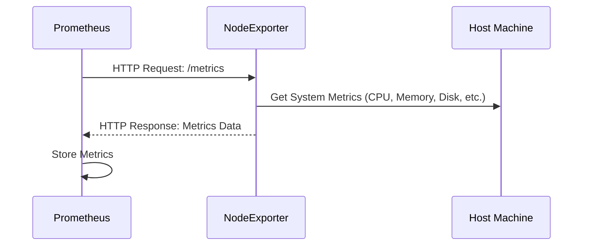

# Chapter 4: Node Exporter

In the previous chapter, [Grafana](03_grafana_.md), we learned how to visualize metrics collected by Prometheus. But where do these metrics *come from* in the first place?  We saw cAdvisor, but what about the server itself? Imagine you want to monitor the CPU usage, memory usage, and disk space of the server that's running all your Docker containers. That's where Node Exporter comes in!

Think of Node Exporter as a little helper that runs on your server and collects system-level metrics. It's like a weather station for your server, reporting on its overall health.

## What is Node Exporter?

Node Exporter is a Prometheus exporter specifically designed to collect metrics from Linux servers. Here's the breakdown:

*   **Metrics:** Like Prometheus itself, Node Exporter deals with numerical data points. These metrics provide information about the server's hardware and operating system. Think of things like:
    *   CPU Usage: How busy is the CPU?
    *   Memory Usage: How much memory is being used?
    *   Disk I/O: How quickly is the server reading and writing data to disk?
    *   Network Traffic: How much data is being sent and received?
*   **Exporter:** Node Exporter "exports" these metrics in a format that Prometheus can understand. This is the process of formatting the metrics for Prometheus to scrape.
*   **Target:** Prometheus treats Node Exporter as a target to "scrape."

## Why use Node Exporter?

Let's say your application is running slowly, and you suspect it might be a server-level issue. Node Exporter allows you to:

*   **Identify resource bottlenecks:** Determine if the server is running out of CPU, memory, or disk space.
*   **Monitor server health:** Get an overall picture of the server's performance.
*   **Troubleshoot performance issues:** Pinpoint the root cause of slow response times.

It allows you to correlate application performance with server resource usage, which is incredibly useful for debugging!

## Getting Started with Node Exporter

In our `docker-compose.yaml` file, we already have a Node Exporter service defined:

```yaml
  node-exporter:
    image: prom/node-exporter
    container_name: node-exporter
    volumes:
      - /proc:/host/proc:ro
      - /sys:/host/sys:ro
      - /:/rootfs:ro
    command: 
      - '--path.procfs=/host/proc' 
      - '--path.sysfs=/host/sys'
      - --collector.filesystem.ignored-mount-points
      - "^/(sys|proc|dev|host|etc|rootfs/var/lib/docker/containers|rootfs/var/lib/docker/overlay2|rootfs/run/docker/netns|rootfs/var/lib/docker/aufs)($$|/)"
    ports:
      - 9100:9100
    networks:
      - prom_net
    restart: unless-stopped
```

Let's break down what this means:

*   `image: prom/node-exporter`: This specifies the Docker image to use for Node Exporter. `prom/node-exporter` is the official Node Exporter image from Docker Hub.
*   `container_name: node-exporter`: This gives the container a name.
*   `volumes:`:  This is crucial! It mounts directories from the host machine into the container. This allows Node Exporter to access system-level information.
    *   `- /proc:/host/proc:ro`: Mounts the `/proc` directory (process information) from the host to `/host/proc` inside the container. `:ro` means read-only.
    *   `- /sys:/host/sys:ro`: Mounts the `/sys` directory (system information) from the host to `/host/sys` inside the container.
    *   `- /:/rootfs:ro`: Mounts the root filesystem from the host into the container.
*   `command:`: These options configure Node Exporter.
    *   `--path.procfs=/host/proc`:  Specifies where the `/proc` filesystem is mounted inside the container.
    *   `--path.sysfs=/host/sys`: Specifies where the `/sys` filesystem is mounted inside the container.
    *   `--collector.filesystem.ignored-mount-points`: Ignores certain mount points to avoid noise.
*   `ports: - 9100:9100`: This maps port 9100 on your host machine to port 9100 on the container. Prometheus will scrape metrics from this port.
*   `networks: - prom_net`: This attaches the Node Exporter container to the `prom_net` network.
*   `restart: unless-stopped`: Makes sure that Node Exporter restarts automatically if it stops, unless you explicitly stop it.

## Configuring Prometheus to Scrape Node Exporter

In the previous chapter, [Prometheus](02_prometheus_.md), we saw a snippet of `prom_config/prometheus.yml` that already includes a job to scrape Node Exporter:

```yaml
  - job_name: 'node-exporter'
    static_configs:
      - targets: ["node-exporter:9100"]
```

This tells Prometheus to scrape the `node-exporter` container at port 9100. Prometheus will periodically connect to Node Exporter and collect its metrics.

## Accessing Node Exporter Metrics

You can access the raw metrics exposed by Node Exporter by opening your browser and going to `http://localhost:9100/metrics`. You'll see a long list of metrics in a text-based format. Don't worry, you don't need to understand all of them! Prometheus will automatically parse this data.

## Querying Node Exporter Metrics in Prometheus

Now that Prometheus is scraping Node Exporter, you can query its metrics in the Prometheus web interface (`http://localhost:9090`).

For example, to see the CPU usage, you can try a query like:

```
rate(node_cpu_seconds_total{mode!="idle"}[5m])
```

This query calculates the rate of change of CPU time spent in non-idle modes over the last 5 minutes. It will give you a general sense of CPU utilization.

## Visualizing Node Exporter Metrics in Grafana

The real power of Node Exporter comes when you visualize its metrics in Grafana. If you imported the "Docker cAdvisor Dashboard", you might also have node-exporter metrics as well, or you can create your own Grafana dashboard and add panels to display metrics like CPU usage, memory usage, and disk space. This will give you a clear and visual overview of your server's health. Explore Grafana's available visualization options, such as graphs, gauges, and tables, to find what best suits your needs.

## Internal Implementation

Let's see what happens behind the scenes when Prometheus scrapes Node Exporter.



1.  Prometheus periodically sends an HTTP request to the `/metrics` endpoint of Node Exporter.
2.  Node Exporter collects system metrics from the host machine by reading files in `/proc` and `/sys` (as configured by the volume mounts).
3.  Node Exporter responds with a text-based format containing the metrics data.
4.  Prometheus parses the metrics data and stores it in its time-series database.

The core functionality of Node Exporter resides within its collectors. The collectors are responsible for gathering specific system metrics. The `main.go` file in Node Exporter sets up the HTTP server and registers the collectors.

Here's a simplified hypothetical Go snippet for collecting CPU metrics (this is significantly simplified!):

```go
// Not actual Node Exporter code
package main

import (
	"fmt"
	"io/ioutil"
	"strings"
)

// Simplified CPU metrics collector
func collectCPUStats() (float64, error) {
	// In a real application, this would read from /proc/stat
	// For this example, we'll simulate reading the file
	cpuStat := `cpu  100 20 30 40 0 0 0 0 0 0` // Example data
	fields := strings.Fields(cpuStat)
	if len(fields) < 5 {
		return 0, fmt.Errorf("invalid cpu stat format")
	}

	user := parseFloat(fields[1]) // Example helper function
	system := parseFloat(fields[3])
	idle := parseFloat(fields[4])

	total := user + system + idle
	usage := (user + system) / total

	return usage, nil
}

// Example parseFloat to avoid requiring conversion libraries
func parseFloat(input string) float64 {
	output := 0.0
	fmt.Sscan(input, &output)
	return float64(output)
}

func main() {
	cpuUsage, err := collectCPUStats()
	if err != nil {
		fmt.Println("Error collecting CPU stats:", err)
		return
	}

	fmt.Printf("CPU Usage: %.2f\n", cpuUsage)
}
```

**Explanation:**

This simplified program demonstrates how Node Exporter might collect CPU usage statistics.
*It simulates reading data from `/proc/stat`, splitting the data into fields, and calculating CPU usage*. A real Node Exporter implementation would use the data to export Prometheus metrics.

## Conclusion

Node Exporter is an essential tool for monitoring the health and performance of your Linux servers. By collecting system-level metrics and exposing them to Prometheus, it allows you to identify resource bottlenecks, troubleshoot performance issues, and gain a deeper understanding of your infrastructure. In the next chapter, [cAdvisor](05_cadvisor_.md), we'll explore another exporter that focuses on container-specific metrics.


