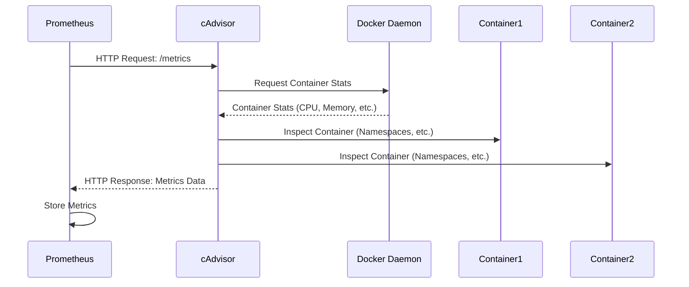

# Chapter 5: cAdvisor

In the previous chapter, [Node Exporter](04_node_exporter_.md), we learned how to monitor the server's overall health. But what if you want to drill down and see how each individual *container* is performing? For example, you might want to know how much CPU each container is using, or how much memory it's consuming. That's where cAdvisor comes in!

Think of cAdvisor as a magnifying glass for your containers. It lets you zoom in and see the resource usage of each one, providing valuable insights for optimizing your application.

## What is cAdvisor?

cAdvisor (Container Advisor) is a tool that collects resource usage and performance metrics from running containers. Here's a breakdown of the key concepts:

*   **Container Metrics:** cAdvisor focuses on metrics specific to containers, such as CPU usage, memory consumption, network I/O, and filesystem I/O.
*   **Automatic Discovery:** cAdvisor automatically discovers all containers running on a node (a physical or virtual machine) without needing any manual configuration for each container.
*   **Prometheus Exporter:** cAdvisor exposes these container metrics in a format that Prometheus can scrape, making it easy to integrate with your existing monitoring setup.

In short, cAdvisor *automatically finds your containers* and tells Prometheus *how they're doing*.

## Why Use cAdvisor?

Imagine you have a web application running in multiple containers. You notice that the application is sometimes slow, but you're not sure which container is causing the problem. cAdvisor helps you:

*   **Identify resource-hungry containers:** Pinpoint the containers that are consuming the most CPU, memory, or other resources.
*   **Optimize resource allocation:**  Adjust resource limits for containers to improve overall application performance.
*   **Detect container performance issues:**  Spot anomalies in container behavior that might indicate problems.

## Getting Started with cAdvisor

In our `docker-compose.yaml` file, we already have a cAdvisor service defined:

```yaml
  cadvisor:
    image: gcr.io/cadvisor/cadvisor:v0.47.0
    container_name: cadvisor
    command:
      - '-port=8080'
    ports:
      - "8080:8080"
    networks:
      - prom_net
    volumes:
      - /:/rootfs:ro
      - /var/run:/var/run:ro
      - /sys:/sys:ro
      - /var/lib/docker/volumes:/var/lib/docker/volumes:ro
      - /dev/disk/:/dev/disk:ro
    devices:
      - /dev/kmsg
    privileged: true
    restart: unless-stopped
```

Let's break down what this means:

*   `image: gcr.io/cadvisor/cadvisor:v0.47.0`:  This specifies the Docker image to use for cAdvisor. Note that this image comes from `gcr.io` (Google Container Registry).
*   `container_name: cadvisor`: This gives the container a name.
*   `command: - '-port=8080'`: This configures cAdvisor to listen on port 8080.
*   `ports: - "8080:8080"`: This maps port 8080 on your host machine to port 8080 on the container. Prometheus will scrape metrics from this port.
*   `networks: - prom_net`: This attaches the cAdvisor container to the `prom_net` network.
*   `volumes:`: These volumes allow cAdvisor to access information about the containers and the host system.
    *   `/:/rootfs:ro`: Read-only access to the root filesystem.
    *   `/var/run:/var/run:ro`: Read-only access to the `/var/run` directory, which contains information about running processes.
    *   `/sys:/sys:ro`: Read-only access to the `/sys` directory, which contains system information.
    *   `/var/lib/docker/volumes:/var/lib/docker/volumes:ro`: Read-only access to Docker volumes.
    *   `/dev/disk/:/dev/disk:ro`: Read-only access to disk device information.
*   `devices: - /dev/kmsg`: Makes the kernel message ring buffer available to cAdvisor.
*   `privileged: true`: This is *required* for cAdvisor to access all the necessary container information. It gives cAdvisor more privileges on the host system.
*   `restart: unless-stopped`: Restarts cAdvisor automatically unless you specifically stop it.

## Configuring Prometheus to Scrape cAdvisor

We need to tell Prometheus to scrape the metrics exposed by cAdvisor. In our `prom_config/prometheus.yml` file, we have the following job:

```yaml
  - job_name: 'cadvisor'
    scrape_interval: 5s
    label_value_length_limit: 500
    sample_limit: 10000
    static_configs:
      - targets: ['cadvisor:8080']
```

This tells Prometheus to scrape the `cadvisor` container on port `8080` every 5 seconds.

## Accessing cAdvisor Metrics

You can access the cAdvisor web UI by opening your browser and going to `http://localhost:8080`. You'll see a basic interface showing information about the containers running on your system. This UI is mainly useful for quickly verifying that cAdvisor is working correctly. The primary goal of cAdvisor is to make the container metrics available for Prometheus scraping, and it is not intended to be a visual dashboard for monitoring.

## Querying cAdvisor Metrics in Prometheus

Now that Prometheus is scraping cAdvisor, you can query its metrics in the Prometheus web interface (`http://localhost:9090`).

For example, to see the CPU usage of all containers, you can try a query like:

```
rate(container_cpu_usage_seconds_total[5m])
```

This query calculates the rate of change of CPU usage for all containers over the last 5 minutes.

To find the memory usage of a specific container (replace `container_name` with the actual name):

```
container_memory_usage_bytes{name="container_name"}
```

## Visualizing cAdvisor Metrics in Grafana

The real power of cAdvisor comes when you visualize its metrics in Grafana.

If you are using the "Docker cAdvisor Dashboard," it likely uses cAdvisor metrics.

You can also create your own Grafana dashboard and add panels to display metrics like CPU usage, memory usage, and network I/O for each container.

## Internal Implementation

Let's see what happens behind the scenes when Prometheus scrapes cAdvisor.



1.  Prometheus periodically sends an HTTP request to the `/metrics` endpoint of cAdvisor.
2.  cAdvisor uses the Docker daemon (or other container runtime) to retrieve resource usage statistics for each container. This is done by interacting with the Docker API.
3.  cAdvisor might also inspect the container for more metadata, like namespaces.
4.  cAdvisor formats the metrics data into a Prometheus-compatible format.
5.  Prometheus parses the metrics data and stores it in its time-series database.

The cAdvisor code is primarily written in Go. Its core components include:

*   **Container Discovery:** Logic to automatically detect running containers.
*   **Collector Plugins:** Plugins for collecting different types of container metrics.
*   **Exporters:** Logic for exposing the collected metrics in various formats (Prometheus, etc.).

Here's a highly simplified hypothetical code example:

```go
// Not actual cAdvisor code
package main

import (
	"fmt"
	"time"
)

// Simplified metric struct
type ContainerMetrics struct {
	CPUUsage    float64
	MemoryUsage uint64
}

// Mock function to get container stats (replace with actual Docker API call)
func getContainerStats(containerID string) ContainerMetrics {
	// In a real application, this would call the Docker API
	// For this example, we'll return some dummy data.
	return ContainerMetrics{
		CPUUsage:    0.25,
		MemoryUsage: 1024 * 1024 * 100, // 100MB
	}
}

// Example to format data into a Prometheus-like format
func formatPrometheusMetrics(containerID string, metrics ContainerMetrics) string {
	return fmt.Sprintf(`
# HELP container_cpu_usage_seconds_total CPU usage in seconds.
container_cpu_usage_seconds_total{container="%s"} %f
# HELP container_memory_usage_bytes Memory usage in bytes.
container_memory_usage_bytes{container="%s"} %d
`, containerID, metrics.CPUUsage, containerID, metrics.MemoryUsage)
}

func main() {
	containerID := "my-container"
	metrics := getContainerStats(containerID)
	prometheusOutput := formatPrometheusMetrics(containerID, metrics)
	fmt.Println(prometheusOutput)

	time.Sleep(time.Second) // Simulate periodic collection
}
```

**Explanation:**

This simplified program simulates collecting container metrics and formatting them for Prometheus. *It replaces the actual Docker API calls* with dummy data. A real cAdvisor implementation would have more sophisticated error handling and metric collection.

## Conclusion

cAdvisor is a valuable tool for monitoring the resource usage of your Docker containers. By providing container-specific metrics to Prometheus, it allows you to identify resource-hungry containers, optimize resource allocation, and troubleshoot performance issues. In the next chapter, [Blackbox Exporter](06_blackbox_exporter_.md), we'll explore another exporter that focuses on probing the availability of your services.


