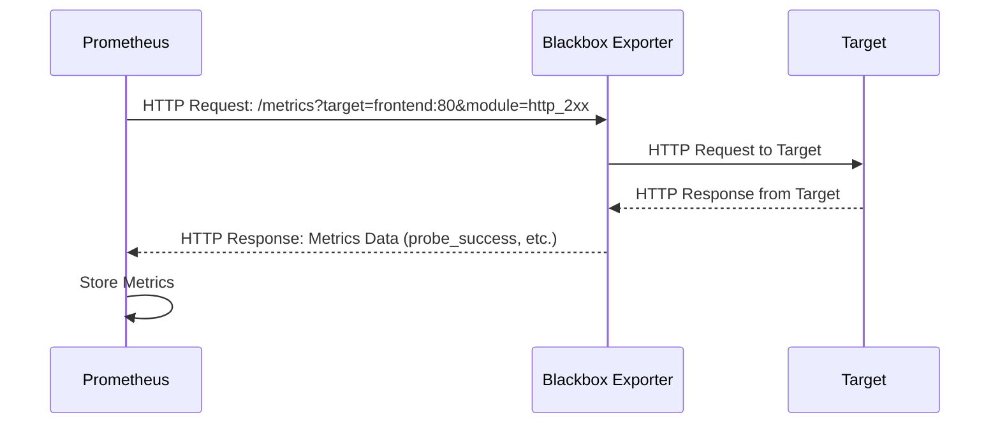

# Chapter 6: Blackbox Exporter

In the previous chapter, [cAdvisor](05_cadvisor_.md), we focused on monitoring the *resource usage* of our containers. But what if we want to simply know if our application is *available*? Imagine you want to know if your website is up and responding to requests. Is it returning a 200 OK status?  That's where the Blackbox Exporter comes in!

Think of the Blackbox Exporter as a health checker for your applications. It's like pinging your website to see if it's alive, but with more sophisticated checks.

## What is the Blackbox Exporter?

The Blackbox Exporter is a Prometheus exporter that allows you to probe the availability of endpoints over different protocols.  Think of it as a network probe that Prometheus can use.  Here's a breakdown of the key concepts:

*   **Probing:** The Blackbox Exporter sends requests to your applications (targets) to check their availability.
*   **Modules:** These define *how* the Blackbox Exporter will probe your targets. You can configure modules for HTTP, TCP, ICMP (ping), and more. You define these in a `blackbox.yaml` file.
*   **Targets:**  These are the applications or services you want to monitor.
*   **Metrics:** The Blackbox Exporter reports metrics about the probe results, such as whether the probe was successful, how long it took, and any error codes.

## Why Use the Blackbox Exporter?

Let's say you have a critical API endpoint that your application relies on.  You want to be alerted immediately if this endpoint becomes unavailable.  The Blackbox Exporter allows you to:

*   **Monitor application uptime:**  Verify that your applications are accessible.
*   **Detect network issues:**  Identify problems like DNS resolution failures or connection timeouts.
*   **Receive alerts when services are down:**  Get notified immediately when a critical endpoint becomes unavailable.

## Getting Started with the Blackbox Exporter

In our `docker-compose.yaml` file, we already have a Blackbox Exporter service defined:

```yaml
  blackbox_exporter:
    image: quay.io/prometheus/blackbox-exporter:latest
    container_name: blackbox_exporter
    ports:
      - "9115:9115"
    configs:
      - source: blackbox_config
        target: /config
    volumes:
      - "./bbox_config:/config"
    networks:
      - prom_net
```

Let's break down what this means:

*   `image: quay.io/prometheus/blackbox-exporter:latest`: This specifies the Docker image to use for the Blackbox Exporter.
*   `container_name: blackbox_exporter`: This gives the container a name.
*   `ports: - "9115:9115"`: This maps port 9115 on your host machine to port 9115 on the container.  Prometheus will scrape metrics from this port.
*   `configs:`: The `configs` sections tells docker compose where to get the configuration for the blackbox exporter.
    *   `source: blackbox_config`: Tells docker compose that the config name is called `blackbox_config`.
    *   `target: /config`: Tells docker compose that the blackbox configuration should be in `/config` inside of the blackbox container.
*   `volumes: - "./bbox_config:/config"`: This mounts a directory `./bbox_config` on your host machine to the `/config` directory inside the container. This is where the Blackbox Exporter expects to find its configuration file (`blackbox.yaml`).
*   `networks: - prom_net`: This attaches the Blackbox Exporter container to the `prom_net` network.

## Configuring the Blackbox Exporter

The configuration for the Blackbox Exporter is defined in the `blackbox.yaml` file. This file specifies the probing modules.

Here's our `bbox_config/blackbox.yaml` file:

```yaml
modules:
 http_2xx:
   prober: http
   timeout: 5s
   http:
     valid_status_codes:
      - 200 # Defaults to 2xx
     method: GET
     fail_if_ssl: false
     fail_if_not_ssl: false
     no_follow_redirects: false
     preferred_ip_protocol: ip4
 tcp_connect:
   prober: tcp
   timeout: 5s
   tcp:
     preferred_ip_protocol: ip4
```

Explanation:

*   `modules:` Defines the probing modules.
*   `http_2xx:` This defines a module named "http_2xx" that probes HTTP endpoints.
    *   `prober: http`: Specifies that this module uses the HTTP prober.
    *   `timeout: 5s`: Sets a timeout of 5 seconds for the probe.
    *   `http:`  Configures the HTTP prober:
        *   `valid_status_codes:` Specifies that a 200 status code is considered a successful probe.
        *   `method: GET`: Specifies that the probe uses the GET method.
*   `tcp_connect:` This defines a module named "tcp_connect" that attempts a TCP connection.
    *   `prober: tcp`: Specifies that this module uses the TCP prober.
    *   `timeout: 5s`: Sets a timeout of 5 seconds for the probe.

## Configuring Prometheus to Scrape the Blackbox Exporter

We need to configure Prometheus to use the Blackbox Exporter to probe our targets. This involves two steps:

1.  **Defining the targets to probe:**  We tell Prometheus *which* applications we want to check.
2.  **Relabeling:**  We tell Prometheus to use the Blackbox Exporter to *reach* those targets.

Here's how we do it in our `prom_config/prometheus.yml` file. Let's look at the `frontend` job:

```yaml
  - job_name: 'frontend'
    metrics_path: /probe
    params:
     module: [http_2xx]
    static_configs:
      - targets:
        - frontend:80
    relabel_configs: 
      - source_labels: [__address__]
        target_label: __param_target
      - source_labels: [__param_target]
        target_label: instance
      - target_label: __address__
        replacement: blackbox_exporter:9115
```

Explanation:

*   `job_name: 'frontend'`:  Defines a job named "frontend."
*   `metrics_path: /probe`:  Specifies the path that the Blackbox Exporter exposes metrics on.
*   `params: module: [http_2xx]`: Tells the Blackbox Exporter to use the `http_2xx` module (defined in `blackbox.yaml`).
*   `static_configs: targets: - frontend:80`: This defines the target to probe: the `frontend` container on port 80.
*   `relabel_configs`: This is the key part!  Relabeling allows you to modify the labels of a metric *before* it is stored in Prometheus. Here, we use it to tell Prometheus to use the Blackbox Exporter to reach the target.
    *   `- source_labels: [__address__] target_label: __param_target`:  Copies the original target address (`frontend:80`) to a temporary label called `__param_target`.
    *   `- source_labels: [__param_target] target_label: instance`: Copies the value of the temporary label to the `instance` label. This is used for identification.
    *   `- target_label: __address__ replacement: blackbox_exporter:9115`:  This is the magic! It *replaces* the target address with the address of the Blackbox Exporter (`blackbox_exporter:9115`).

**What's happening?**

1.  Prometheus *thinks* it's scraping `blackbox_exporter:9115`.
2.  The Blackbox Exporter receives the request.
3.  Because of the `__param_target` label, the Blackbox Exporter knows to probe `frontend:80` using the `http_2xx` module.
4.  The Blackbox Exporter reports the probe results back to Prometheus.

## Accessing Blackbox Exporter Metrics

You can access the raw metrics exposed by the Blackbox Exporter by opening your browser and going to `http://localhost:9115/metrics`.

You'll see a list of metrics related to the probes.  The most important one is `probe_success`.

## Querying Blackbox Exporter Metrics in Prometheus

Now that Prometheus is scraping the Blackbox Exporter, you can query its metrics in the Prometheus web interface (`http://localhost:9090`).

To check if the `frontend` is up, you can use the following query:

```
probe_success{instance="frontend:80"}
```

If the probe was successful, the value will be `1`. If it failed, the value will be `0`.

## Visualizing Blackbox Exporter Metrics in Grafana

You can create a Grafana dashboard to visualize the `probe_success` metric. This will give you a clear view of the availability of your applications.  You can also create alerts based on this metric to get notified when a service becomes unavailable.

## Internal Implementation

Let's see what happens behind the scenes when Prometheus scrapes the Blackbox Exporter.



1.  Prometheus sends an HTTP request to the `/metrics` endpoint of the Blackbox Exporter. The request includes the `target` and `module` parameters, specifying which target to probe and which module to use.  The relabeling in `prometheus.yml` makes this happen transparently.
2.  The Blackbox Exporter uses the specified module to probe the target.  In the case of `http_2xx`, it sends an HTTP request to the target.
3.  The target responds to the Blackbox Exporter.
4.  The Blackbox Exporter analyzes the response and generates metrics (e.g., `probe_success`, `probe_duration_seconds`).
5.  The Blackbox Exporter responds to Prometheus with the metrics data.
6.  Prometheus stores the metrics in its time-series database.

The Blackbox Exporter is implemented in Go.  Key components of the code include:

*   **Configuration Parsing:** Reading the `blackbox.yaml` file and parsing the module definitions.
*   **Probers:** Implementations for different probing protocols (HTTP, TCP, ICMP).
*   **Metrics Generation:** Logic for generating Prometheus metrics based on the probe results.

A simplified example might look like this:

```go
// Not actual Blackbox Exporter code
package main

import (
	"fmt"
	"net/http"
	"time"
)

// Simplified HTTP prober
func probeHTTP(target string) (bool, time.Duration, error) {
	start := time.Now()
	resp, err := http.Get(target) // Basic HTTP GET request
	duration := time.Since(start)
	if err != nil {
		return false, duration, err
	}
	defer resp.Body.Close()

	if resp.StatusCode >= 200 && resp.StatusCode < 300 { // Check for 2xx status
		return true, duration, nil
	}
	return false, duration, fmt.Errorf("unexpected status code: %d", resp.StatusCode)
}

func main() {
	target := "http://example.com" // Probe example.com
	success, duration, err := probeHTTP(target)

	if err != nil {
		fmt.Printf("Probe failed: %v\n", err)
	}

	fmt.Printf("Probe success: %t, duration: %v\n", success, duration)
}
```

**Explanation:**

This simplified program *demonstrates how the Blackbox Exporter might probe an HTTP endpoint*.  It makes a GET request and checks for a 2xx status code. A real Blackbox Exporter would format the results into Prometheus metrics. It would also have the ability to read probes from the configuration file.

## Conclusion

The Blackbox Exporter is an invaluable tool for monitoring the availability of your applications. By probing endpoints over various protocols, it allows you to detect outages, troubleshoot network issues, and ensure that your services are always up and running. In the next chapter, [Alertmanager](07_alertmanager_.md), we'll learn how to configure Alertmanager to receive notifications when Prometheus detects problems with our applications.


