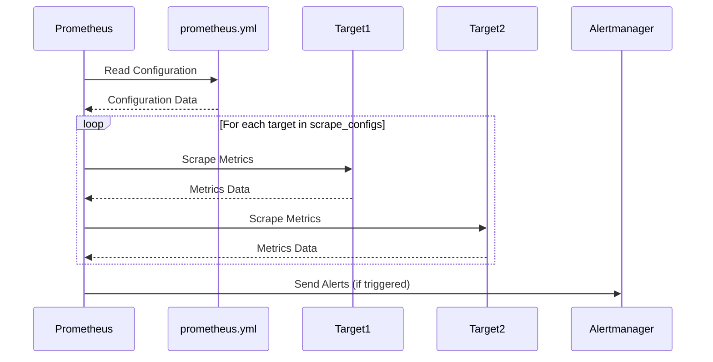

# Chapter 8: Prometheus Configuration (prometheus.yml)

In the previous chapter, [Alertmanager](07_alertmanager_.md), we learned how to set up a system to get notified when things go wrong with our applications. But how does Prometheus *know* what to monitor in the first place? The answer lies in the `prometheus.yml` file!

Think of `prometheus.yml` as the brain of Prometheus. It's a configuration file that tells Prometheus everything it needs to know: where to find metrics, how often to collect them, and where to send alerts. Without it, Prometheus wouldn't know what to do.

This chapter will guide you through understanding this crucial file so you can effectively configure Prometheus for your monitoring needs.

## What is `prometheus.yml`?

`prometheus.yml` is the main configuration file for Prometheus. It's written in YAML (Yet Another Markup Language), a human-readable data serialization format. Let's break down the key sections of this file:

1.  **`global`:** This section defines global settings for Prometheus, like how often to scrape targets.
2.  **`scrape_configs`:** This is where you tell Prometheus *what* to monitor. You define jobs and targets within this section. A "job" groups targets that should be scraped the same way. A "target" is something Prometheus monitors (like a Node Exporter or a web application).
3.  **`alerting`:**  This section configures how Prometheus sends alerts to Alertmanager.
4.  **`rule_files`:**  This specifies the paths to files containing alerting rules (covered in [Alerting Rules (rules.yml)](09_alerting_rules__rules_yml__.md)).

Let's explore each section with examples!

### The `global` Section

The `global` section sets global parameters that affect Prometheus's overall behavior.

```yaml
global:
  scrape_interval: 15s
  evaluation_interval: 30s
```

*   `scrape_interval`: This tells Prometheus how often to collect metrics from each target. In this case, it's set to 15 seconds. Prometheus will ask for metrics every 15 seconds.
*   `evaluation_interval`:  This determines how often Prometheus evaluates alerting rules (which are defined in separate files, as we'll see in [Alerting Rules (rules.yml)](09_alerting_rules__rules_yml__.md)).

### The `scrape_configs` Section: Defining What to Monitor

This is arguably the most important section. It defines the "scrape jobs" that tell Prometheus what to monitor.

```yaml
scrape_configs:
  - job_name: 'node-exporter'
    static_configs:
      - targets: ["node-exporter:9100"]
```

*   `job_name`: This is a name you give to the job. It should be descriptive, like `'node-exporter'`.
*   `static_configs`: This tells Prometheus where to find the targets.
    *   `targets`: This is a list of addresses (hostname:port) of the targets you want to monitor. Here, we're monitoring the `node-exporter` container on port 9100. Because we are using docker compose, the container name is the DNS hostname available to Prometheus.

Let's break this down with an analogy. Imagine you're a detective (Prometheus), and you need to investigate different locations (targets). The `scrape_configs` section tells you where those locations are (`targets`) and gives you a name for each investigation (`job_name`).

Here's another example of a `scrape_config` for cAdvisor:

```yaml
  - job_name: 'cadvisor'
    scrape_interval: 5s
    label_value_length_limit: 500
    sample_limit: 10000
    static_configs:
      - targets: ['cadvisor:8080']
```

This tells Prometheus to scrape metrics from the `cadvisor` container every 5 seconds. `label_value_length_limit` and `sample_limit` are parameters to limit the amount of data cAdvisor can return.

#### Using Blackbox Exporter to Probe Endpoints

A more complex configuration involves using the Blackbox Exporter to probe endpoints.

```yaml
  - job_name: 'frontend'
    metrics_path: /probe
    params:
     module: [http_2xx]
    static_configs:
      - targets:
        - frontend:80
    relabel_configs:
      - source_labels: [__address__]
        target_label: __param_target
      - source_labels: [__param_target]
        target_label: instance
      - target_label: __address__
        replacement: blackbox_exporter:9115
```

*   `metrics_path: /probe`: Specifies the path for Blackbox Exporter metrics.
*   `params: module: [http_2xx]`:  Tells Blackbox Exporter to use the "http_2xx" module (defined in `blackbox.yaml` - see [Blackbox Exporter](06_blackbox_exporter_.md)).
*   `relabel_configs`: This is crucial for telling Prometheus to use Blackbox Exporter for probing. The relabeling rules rewrite the target address to point to the Blackbox Exporter. See the [Blackbox Exporter](06_blackbox_exporter_.md) chapter for more details.

### The `alerting` Section

This section tells Prometheus where to send alerts when they are triggered.

```yaml
alerting:
  alertmanagers:
    - static_configs:
      - targets:
        - alertmanager:9093
```

This configuration tells Prometheus to send alerts to the `alertmanager` container on port 9093. Alertmanager then handles the routing, grouping, and sending of these alerts to the appropriate receivers (like Slack or email, as configured in Alertmanager's configuration). This was covered in [Alertmanager](07_alertmanager_.md).

### The `rule_files` Section

This section tells Prometheus where to find the alerting rules. These rules define the conditions that trigger alerts.

```yaml
rule_files:
  - ./rules.yml
```

This tells Prometheus to load the alerting rules from a file named `rules.yml` in the same directory as the `prometheus.yml` file. We'll explore the structure of `rules.yml` in detail in the next chapter, [Alerting Rules (rules.yml)](09_alerting_rules__rules_yml__.md).

## Putting it All Together: A Complete `prometheus.yml` Example

Here's a simplified but complete `prometheus.yml` file that incorporates the sections we've discussed:

```yaml
global:
  scrape_interval: 15s
  evaluation_interval: 30s

alerting:
  alertmanagers:
    - static_configs:
      - targets:
        - alertmanager:9093

rule_files:
  - ./rules.yml

scrape_configs:
  - job_name: 'node-exporter'
    static_configs:
      - targets: ["node-exporter:9100"]

  - job_name: 'cadvisor'
    scrape_interval: 5s
    static_configs:
      - targets: ['cadvisor:8080']

  - job_name: 'frontend'
    metrics_path: /probe
    params:
     module: [http_2xx]
    static_configs:
      - targets:
        - frontend:80
    relabel_configs:
      - source_labels: [__address__]
        target_label: __param_target
      - target_label: __address__
        replacement: blackbox_exporter:9115
```

## How Prometheus Uses `prometheus.yml`

When Prometheus starts, it reads the `prometheus.yml` file. Let's break down the steps:



1.  Prometheus reads the `prometheus.yml` file.
2.  For each target defined in the `scrape_configs` section, Prometheus scrapes the target at the specified `scrape_interval`.
3.  Prometheus stores the collected metrics in its time-series database.
4.  Prometheus evaluates alerting rules (defined in the `rule_files`) at the specified `evaluation_interval`.
5.  If an alerting rule is triggered, Prometheus sends an alert to Alertmanager.

Prometheus uses the `go-yaml/yaml` library for parsing. The `main.go` in the Prometheus source code contains logic for reading and parsing this YAML file. Here's a simplified (and hypothetical) example of how Prometheus might parse the `scrape_configs` section:

```go
// This is not actual Prometheus code
package main

import (
	"fmt"
	"io/ioutil"
	"gopkg.in/yaml.v2" // You might need to install this: go get gopkg.in/yaml.v2
)

type Config struct {
	Global struct {
		ScrapeInterval string `yaml:"scrape_interval"`
	} `yaml:"global"`
	ScrapeConfigs []struct {
		JobName string `yaml:"job_name"`
		StaticConfigs []struct {
			Targets []string `yaml:"targets"`
		} `yaml:"static_configs"`
	} `yaml:"scrape_configs"`
}

func main() {
	// Read the YAML file
	yamlFile, err := ioutil.ReadFile("prom_config/prometheus.yml") // Use your prom_config
	if err != nil {
		fmt.Printf("Error reading YAML file: %s\n", err)
		return
	}

	// Unmarshal the YAML data into the Config struct
	var config Config
	err = yaml.Unmarshal(yamlFile, &config)
	if err != nil {
		fmt.Printf("Error unmarshaling YAML: %s\n", err)
		return
	}

	// Print the parsed data (for demonstration)
	fmt.Printf("Scrape Interval: %s\n", config.Global.ScrapeInterval)
	for _, job := range config.ScrapeConfigs {
		fmt.Printf("Job Name: %s\n", job.JobName)
		for _, staticConfig := range job.StaticConfigs {
			fmt.Printf("  Targets: %v\n", staticConfig.Targets)
		}
	}
}
```

This code reads the `prometheus.yml` file, parses it, and then prints out the `scrape_interval` and the targets for each job. Note that this is a simplified version and doesn't include all the error handling and validation that would be present in the real Prometheus code.

## Conclusion

The `prometheus.yml` file is the central configuration file for Prometheus. It defines what to monitor, how often to monitor it, and where to send alerts. Understanding this file is essential for effectively using Prometheus to monitor your applications and infrastructure. Now that you understand the Prometheus configuration, let's move on to defining the specific rules that trigger alerts in [Alerting Rules (rules.yml)](09_alerting_rules__rules_yml__.md).


