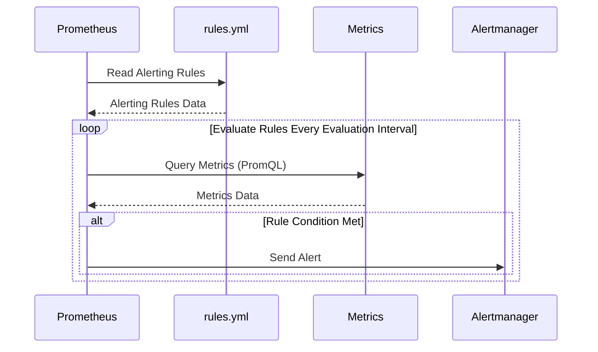

# Chapter 9: Alerting Rules (rules.yml)

In the previous chapter, [Prometheus Configuration (prometheus.yml)](08_prometheus_configuration__prometheus_yml__.md), we learned how to configure Prometheus to collect metrics from our applications. But collecting metrics is only half the battle! We also need to define what constitutes a problem and *when* to be alerted. That's where the `rules.yml` file comes in.

Think of `rules.yml` as the brain that tells Prometheus when to sound the alarm. It contains the alerting rules that define when Prometheus should send an alert to Alertmanager (which we configured in [Alertmanager](07_alertmanager_.md)).

Imagine you want to be alerted if your website's response time exceeds 1 second. The `rules.yml` file lets you define this condition as an alerting rule. Let's see how!

## What is `rules.yml`?

`rules.yml` is a YAML file that contains a list of alerting rules. Each rule defines a condition that, when met, triggers an alert. Let's break down the key components of an alerting rule:

1.  **`alert`:** The name of the alert. This is a short, descriptive name (e.g., `HighCPUUsage`, `ServiceDown`).
2.  **`expr`:** The Prometheus Query Language (PromQL) expression that defines the condition.  This is the "if" part of the "if-then" statement. We'll explore PromQL in more detail in the next chapter, [PromQL (Prometheus Query Language)](10_promql__prometheus_query_language__.md).
3.  **`for`:**  How long the condition must be true before the alert is triggered. This prevents transient spikes from triggering alerts.
4.  **`labels`:**  Labels to add to the alert.  These labels can be used for routing alerts in Alertmanager (as we saw in [Alertmanager](07_alertmanager_.md)).
5.  **`annotations`:** Descriptive information about the alert, such as a summary and a description. This information is included in the alert notification.

Let's look at an example!

## A Simple `rules.yml` Example

Here's a snippet from our `prom_config/rules.yml` file:

```yaml
groups:
  - name: Application_Status
    rules:
      - alert: BackendDown
        annotations:
          description: Backend pod HTTP traffic to port 5000 is down for more than 1 minutes.
          summary: Backend pod HTTP 5000 is down (instance {{ $labels.instance }})
        expr: probe_success{instance="backend-service:5000"} == 0
        for: 10s
        labels:
          severity: critical
```

Let's break down what this rule means:

*   `groups:` Alerting rules are organized into groups for logical organization
    * `name: Application_Status`: Name for the alert group
    * `rules`: List of alerts in this group
        *   `alert: BackendDown`: The name of this alert is `BackendDown`.
        *   `annotations:` Adds metadata for alert
            *   `description`: Description of the alert
            *   `summary`: Short summary of the alert
        *   `expr: probe_success{instance="backend-service:5000"} == 0`: This is the PromQL expression.  It checks if the `probe_success` metric for the `backend-service:5000` instance is equal to 0.  Remember from [Blackbox Exporter](06_blackbox_exporter_.md), the `probe_success` metric is 1 if the service is up and 0 if it's down.
        *   `for: 10s`: The condition must be true for 10 seconds before the alert is triggered.
        *   `labels: severity: critical`: Adds a label `severity: critical` to the alert.  This label can be used to route the alert to a specific receiver in Alertmanager (as we saw in [Alertmanager](07_alertmanager_.md)).

**What will happen?**

If the `probe_success` metric for `backend-service:5000` is 0 for 10 seconds, Prometheus will trigger an alert named `BackendDown`. This alert will have the `severity: critical` label and will be sent to Alertmanager. Alertmanager will then route the alert to the appropriate receiver based on its configuration (e.g., sending a notification to a Slack channel).

Here's another example, for the frontend:

```yaml
      - alert: FrontendDown
        annotations:
          description: Frontend pod HTTP traffic to port 5000 is down for more than 1 minutes.
          summary: Frontend pod HTTP 5000 is down (instance {{ $labels.instance }})
        expr: probe_success{instance="frontend:80"} == 0
        for: 10s
        labels:
          severity: critical
```

The only difference is that it monitors `probe_success{instance="frontend:80"}`.

## How Prometheus Uses `rules.yml`

When Prometheus starts, it reads the `rules.yml` file (as specified in the `prometheus.yml` file's `rule_files` section). It then continuously evaluates the expressions defined in the alerting rules.



1.  Prometheus reads the `rules.yml` file and parses the alerting rules.
2.  At each `evaluation_interval` (defined in `prometheus.yml`), Prometheus queries the metrics specified in the `expr` of each rule.
3.  If the expression evaluates to `true` for the duration specified in the `for` field, Prometheus sends an alert to Alertmanager.

Prometheus's `notifier` package handles alerting. The `main.go` file and related files contain logic for reading the rules and evaluating them.

Here's a *highly simplified* hypothetical code example:

```go
// This is not actual Prometheus code
package main

import "fmt"

// Simplified alert rule struct
type AlertRule struct {
	Name      string
	Expr      string
	For       int
	// In real Prometheus, Expr would be parsed into an executable form
}

// Simplified function to evaluate an alert rule (this is where PromQL would be evaluated)
func evaluateRule(rule AlertRule) bool {
	// This is a placeholder - in reality, this would query the metrics database
	// and evaluate the PromQL expression
	if rule.Name == "BackendDown" {
		// Simulate backend being down
		return true
	}
	return false
}

func main() {
	// Example rule
	rule := AlertRule{
		Name: "BackendDown",
		Expr: "probe_success{instance=\"backend-service:5000\"} == 0",
		For:  10,
	}

	// Evaluate the rule
	isFiring := evaluateRule(rule)

	if isFiring {
		fmt.Println("Alert! BackendDown is firing!")
		// In real Prometheus, this is where the alert would be sent to Alertmanager
	} else {
		fmt.Println("Backend is up")
	}
}
```

**Explanation:**

This simplified program demonstrates how Prometheus might evaluate an alerting rule. It has a placeholder for querying the metrics database and evaluating the PromQL expression. In a real implementation, the `Expr` would be a parsed PromQL query, and the `evaluateRule` function would fetch data and run the query against it.

## Connecting the Dots: Prometheus, `rules.yml`, and Alertmanager

Let's recap how all these pieces work together:

1.  **Prometheus Configuration (`prometheus.yml`):**  Tells Prometheus where to find metrics (`scrape_configs`) and where to send alerts (`alerting`).  It also tells Prometheus where to find the alerting rules (`rule_files`).
2.  **Alerting Rules (`rules.yml`):** Defines the conditions that trigger alerts (using PromQL expressions).
3.  **Alertmanager Configuration (`alertmanager.yml`):** Defines how to route and handle alerts (grouping, deduplication, silencing, and sending to receivers like Slack or email).

## Conclusion

The `rules.yml` file is essential for defining what constitutes a problem and when to be alerted. By combining PromQL expressions with thresholds and labels, you can create powerful alerting rules that ensure you're notified of critical issues in your applications and infrastructure. Now that you understand how to define alerting rules, let's dive deeper into PromQL, the language used to query metrics in Prometheus, in the next chapter, [PromQL (Prometheus Query Language)](10_promql__prometheus_query_language__.md).


