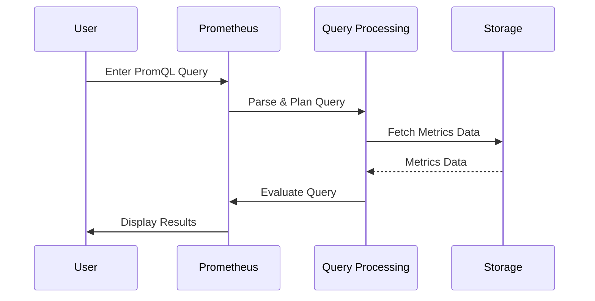

# Chapter 10: PromQL (Prometheus Query Language)

In the previous chapter, [Alerting Rules (rules.yml)](09_alerting_rules__rules_yml__.md), we learned how to set up rules that trigger alerts based on certain conditions. But how do we *actually define* those conditions? We need a way to ask Prometheus questions about the data it has collected. That's where PromQL (Prometheus Query Language) comes in!

Think of PromQL as a search engine specifically designed for time-series data (data that changes over time). It's how you tell Prometheus what data you're interested in and how to analyze it.

Imagine you want to know the average CPU usage of your backend server over the last hour. PromQL is the language you use to ask Prometheus that question. Let's learn how!

## What is PromQL?

PromQL is the query language used to interact with Prometheus. Here's the breakdown:

*   **Query Language:** It's a language designed for querying time-series data.
*   **Metrics Selection:** PromQL lets you select specific metrics from Prometheus's database.
*   **Aggregation:** You can use PromQL to perform calculations on metrics, like finding averages, sums, or rates of change.
*   **Filtering:** PromQL allows you to filter metrics based on labels (key-value pairs that identify a metric).

In short, PromQL is a powerful tool for extracting insights from the data Prometheus collects.

## Key Concepts in PromQL

Let's break down some of the core concepts you'll use in PromQL:

1.  **Metric Names:** The name of the metric you want to query (e.g., `cpu_usage_seconds_total`, `http_requests_total`). These names come from the exporters (like Node Exporter and cAdvisor) that Prometheus scrapes.

2.  **Labels:** Key-value pairs that provide context about a metric. Labels are enclosed in curly braces `{}`. For example: `{instance="node-exporter:9100", job="node-exporter"}`.

3.  **Range Vectors:** Selects a range of data over time. This is specified using square brackets `[]` and a time duration (e.g., `[5m]` for 5 minutes, `[1h]` for 1 hour).

4.  **Functions:** PromQL provides built-in functions for aggregating and manipulating data (e.g., `rate()`, `avg_over_time()`, `sum()`).

5.  **Operators:** You can use operators to perform calculations and comparisons (e.g., `+`, `-`, `*`, `/`, `==`, `>`).

## A Simple PromQL Query

Let's start with the simplest possible PromQL query:

```
up
```

This query returns the current value of the `up` metric for all targets. The `up` metric is a built-in metric that indicates whether a target is up (1) or down (0).

**What will happen?**

Prometheus will execute the query and display the results. You'll see a table or graph showing the value of the `up` metric for each of your targets. A value of `1` means the target is up and reachable, and `0` means the target is down.

## Filtering with Labels

Now let's add some labels to filter the results:

```
up{job="node-exporter"}
```

This query returns the `up` metric, but only for targets that have the label `job="node-exporter"`. This allows you to focus on specific targets.

**What will happen?**

Prometheus will return the `up` metric *only* for the Node Exporter targets. This helps you isolate the results you're interested in.

## Using Range Vectors and Functions

To analyze data over time, you use range vectors and functions. For example, let's calculate the rate of HTTP requests over the last 5 minutes:

```
rate(http_requests_total[5m])
```

*   `http_requests_total`: This is the name of the metric (the total number of HTTP requests).
*   `[5m]`: This selects a range of data over the last 5 minutes (a range vector).
*   `rate()`: This function calculates the per-second average rate of increase of the metric in the range vector.

**What will happen?**

Prometheus will calculate the rate of HTTP requests per second over the last 5 minutes. This gives you a sense of the traffic your application is handling.

## Aggregation Operators

PromQL provides aggregation operators to combine data from multiple time series into a single result. Here's an example:

```
sum(rate(http_requests_total[5m]))
```

This query calculates the sum of the rate of HTTP requests across all instances. This gives you the total request rate for your entire system.

## Using PromQL in Alerting Rules

The real power of PromQL comes when you use it in alerting rules. Let's revisit the `BackendDown` alert from [Alerting Rules (rules.yml)](09_alerting_rules__rules_yml__.md):

```yaml
groups:
  - name: Application_Status
    rules:
      - alert: BackendDown
        annotations:
          description: Backend pod HTTP traffic to port 5000 is down for more than 1 minutes.
          summary: Backend pod HTTP 5000 is down (instance {{ $labels.instance }})
        expr: probe_success{instance="backend-service:5000"} == 0
        for: 10s
        labels:
          severity: critical
```

The `expr` field uses PromQL to define the condition that triggers the alert: `probe_success{instance="backend-service:5000"} == 0`. This expression checks if the `probe_success` metric for the `backend-service:5000` instance is equal to 0 (meaning the backend is down).

**What will happen?**

If the `probe_success` metric is 0 for 10 seconds, Prometheus will trigger the `BackendDown` alert. This shows how PromQL is used to define the logic for determining when something is wrong.

## Internal Implementation

Let's see what happens behind the scenes when Prometheus executes a PromQL query.



1.  The user enters a PromQL query in the Prometheus web interface or uses the Prometheus API.
2.  Prometheus parses the query and creates an execution plan. This involves breaking down the query into smaller steps and determining the most efficient way to retrieve the data.
3.  Prometheus fetches the required metrics data from its storage engine.
4.  Prometheus evaluates the query based on the retrieved data and the execution plan. This involves applying functions, operators, and filters to the data.
5.  Prometheus displays the results to the user.

The core of PromQL evaluation lies in the `promql` directory within the Prometheus source code. Key components include:

*   **Parser:** Converts the PromQL query string into an abstract syntax tree (AST). This is what is being translated from `rate(http_requests_total[5m])` to a format the computer can understand.
*   **Engine:** Executes the query plan.
*   **Functions:** Implementations for the built-in PromQL functions (e.g., `rate()`, `avg_over_time()`).

Here's a *highly simplified* (and hypothetical) example of how Prometheus might evaluate a PromQL query:

```go
// Not actual Prometheus code
package main

import "fmt"

// Simplified metric data struct
type MetricData struct {
	Value float64
}

// Simplified function to evaluate a PromQL expression (this is a placeholder)
func evaluatePromQL(query string) float64 {
	// This is a placeholder - in reality, this would parse the PromQL query,
	// fetch the required metrics, and perform the calculations.

	if query == "probe_success{instance=\"backend-service:5000\"}" {
		// Simulate the backend being up
		return 1.0
	}
	return 0.0
}

func main() {
	query := "probe_success{instance=\"backend-service:5000\"}"
	result := evaluatePromQL(query)

	fmt.Printf("Result of query '%s': %f\n", query, result)
}
```

**Explanation:**

This simplified program *simulates how Prometheus might evaluate a PromQL query*. It replaces the actual parsing and evaluation logic with a placeholder function. In a real implementation, the `evaluatePromQL` function would parse the query, fetch the required metrics from its storage engine, and perform the necessary calculations.

## Conclusion

PromQL is a powerful and flexible query language that allows you to extract valuable insights from the metrics collected by Prometheus. By understanding the key concepts of PromQL, you can create sophisticated queries to monitor your applications and infrastructure, define alerting rules, and troubleshoot performance issues. This chapter provided a basic introduction to PromQL. To continue from here, it's recommended to try it out yourself in Grafana. From here, you can explore external resources for further learning.


