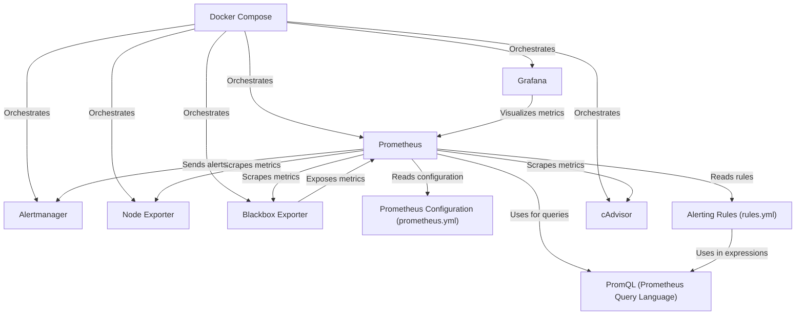

# Tutorial: container-monitoring

This project uses a **monitoring system** to keep track of the health and performance of a multi-container application.  It uses *Prometheus* to collect metrics, *Grafana* to visualize them, and *Alertmanager* to send notifications when something goes wrong.  *Docker Compose* makes it easy to run all these components together.

**Source Repository:** [https://github.com/samin-irtiza/container-monitoring](https://github.com/samin-irtiza/container-monitoring)

## Chapters

1. [Docker Compose](01_docker_compose_.md)
2. [Prometheus](02_prometheus_.md)
3. [Grafana](03_grafana_.md)
4. [Node Exporter](04_node_exporter_.md)
5. [cAdvisor](05_cadvisor_.md)
6. [Blackbox Exporter](06_blackbox_exporter_.md)
7. [Alertmanager](07_alertmanager_.md)
8. [Prometheus Configuration (prometheus.yml)](08_prometheus_configuration__prometheus_yml__.md)
9. [Alerting Rules (rules.yml)](09_alerting_rules__rules_yml__.md)
10. [PromQL (Prometheus Query Language)](10_promql__prometheus_query_language__.md)

